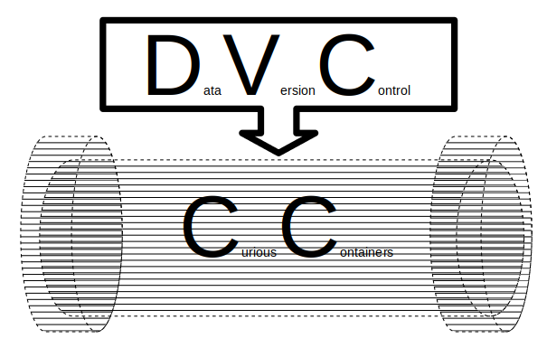

DVC-CC is a wrapper for using the tool [**D**ata **V**ersion **C**ontrol (DVC)](www.dvc.org) to make it possible to 
use DVC to run your script in a cloud. To make this idea possible, we wrote a script that is part of a docker image 
that can:

1. download a git repository,
2. download all required files with your DVC storage server,
3. execute your script, and
4. push the results to GIT and to your DVC storage server.

To assign the right hardware for your need in the cloud, we use
[**C**urious **C**ontainers (CC)](https://www.curious-containers.cc/). This Software runs on our cloud and manages the
 cloud.


## Installation of DVC-CC

DVC-CC is written in python so you can easily install DVC-CC by using pip.
We recommend that you install DVC-CC in a conda environment.
You can use [anaconda](https://www.anaconda.com/distribution/) or miniconda.
For windows user We recommend
[this website](https://www.earthdatascience.org/workshops/setup-earth-analytics-python/setup-git-bash-conda/)
to install miniconda.

You can create, and activate an environment with the following lines:

```bash
conda create --name dvc_cc python pip
conda activate dvc_cc
```

If `conda activate dvc_cc` does not work, try `source activate dvc_cc`.

### Installation with pip
The following script will install the client on your computer:

```bash
pip install --upgrade dvc-cc
```

If you have problems on windows with "win32file", you need to install pywin32 with `conda install -c anaconda pywin32`.

### Installation from source

If you want to install the latest version from source you can install it with [poetry](https://poetry.eustace.io/).

```bash
git clone https://github.com/deep-projects/dvc-cc.git
cd dvc-cc/dvc-cc
poetry build
pip install dvc_cc-?????.whl # replace ????? with the current version that you build in the previous step.
```

## Get started
Install DVC-CC and take a look at [this tutorial](dvc-cc/tutorial/Get_Started.md).

### Tutorials
- [Working with jupyter notebooks](dvc-cc/tutorial/_working_with_jupyter_notebook.md)
- [working with sshfs](dvc-cc/tutorial/_working_with_sshfs.md)
- [DVC-CC Settings](dvc-cc/tutorial/_settings.md)
- [Working with pure DVC syntax](dvc-cc/tutorial/_only_dvc.md)
- [Using live output](dvc-cc/tutorial/_live_output.md)
- <del>[An old tutorial](dvc-cc/tutorial/SimpleStart.md)</del>

## Structure of this repository


## Acknowledgements
The DVC-CC software is developed at CBMI (HTW Berlin - University of Applied Sciences). The work is supported by the
German Federal Ministry of Education and Research (project deep.TEACHING, grant number 01IS17056 and project
deep.HEALTH, grant number 13FH770IX6).
